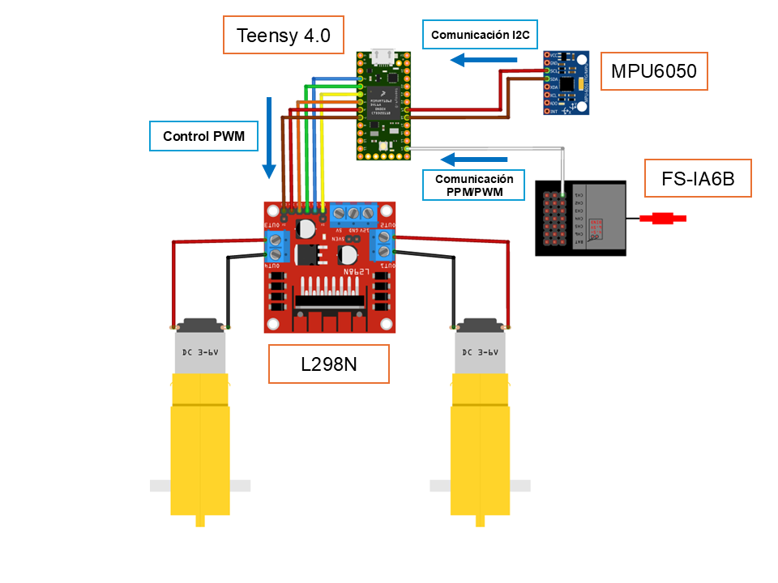
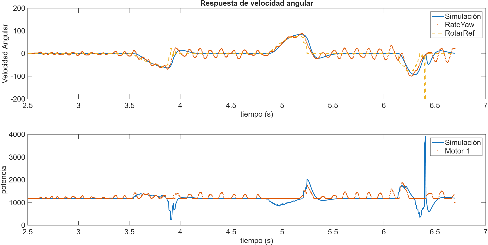
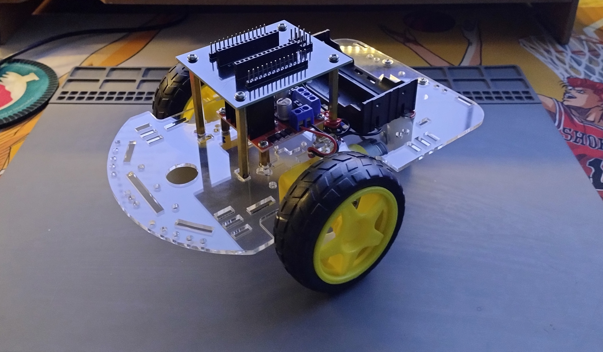

# 🚀 Assisted-Trajectory Robot Car

## 📖 Overview
This model robot car was developed and built to implement an assisted-trajectory (Drive by Wire) system. The system is controlled using a Teensy 4.0 microcontroller to enhance computational speed and stability.  

A gyroscope MPU6050 measures angular velocity, while an H-bridge L298N drives the motors. The robot is operated via a Flysky FS-6X remote using a PPM/PWM modulated signal.

## 📂 Contents
- `/Hardware` → schematic, PCB, Gerbers.
- `/control_car` → C code for Teensy in the Arduino environment.
- `/docs` → photos.

## 🌐 YouTube
📺 [My Playlist](https://youtube.com/playlist?list=PLy6JmHc8bVqIY5rbHkpyFbhlm4xQOCF1T&si=1QBgLZTLAjbxRnrU)

## ⚙️ System Description — Auto Robot (Assisted-Trajectory)
- **Controller:** Teensy 4.0 (high-speed MCU for improved stability and processing)  
- **Sensors:** Gyroscope (angular velocity) and supporting encoders/IMU as available  
- **Actuators:** Dual DC motors with H-bridge driver  
- **Control Strategy:** PI-assisted trajectory control (drive-by-wire)  
- **Sampling period:** **0.004 seconds (250 Hz)**  
- **Data transmission:** UART link to a **Raspberry Pi 4B** for logging and postprocessing  
- **Data logging:** Raspberry Pi saves incoming telemetry to `.csv` files for analysis  
- **Visualization:**  offline monitoring and plotting via Matlab

## 🔄 Control Loop

### Controlled Variables
- **Yaw** → Angular velocity control (rotation rate)

## 📐 Digital PID Control

The UAV uses a discrete PI controller implemented on a Teensy microcontroller.  
The control law in the digital domain is expressed as:

$$
u(n) = u(n-1) + K_0 e(n) + K_1 e(n-1)
$$

Digital PI controller implemented for Yaw rate measured in Gyroscope,

$$
Gyro_{PWM}(n) = Gyro_{PWM}(n-1) + K_0 e(n) + K_1 e(n-1)
$$

### Parameters:
The parameters are adjusted for the angular rate,

$$
K_0 = K_p + \frac{K_p}{2T_i} T_s
$$

$$
K_1 = -K_p + \frac{K_p}{2T_i} T_s
$$

### Control Signal:

$$
motor_1=PWR_{PWM}+Gyro_{PWM}
$$
$$
motor_2=PWR_{PWM}-Gyro_{PWM}
$$

## :triangular_ruler: Connection Diagram

## 🧪 PI Control Test and ARX Model Comparison  

A test was performed using a **PI controller** applied to the assisted trajectory system of the robot car.  
The experimental results were compared against a **linear ARX model** identified from system data.  

### 🔹 General ARX Model Equation  

The ARX (Auto-Regressive with eXogenous input) model is defined as:  

$$
y(k) + a_1 y(k-1) + a_2 y(k-2) + \dots + a_{n_a} y(k-n_a) =
b_1 u(k-1) + b_2 u(k-2) + \dots + b_{n_b} u(k-n_b) + e(k)
$$  

Where:  
- $$y(k)$$: system output at sample $$k$$ 
- $$u(k)$$: input signal at sample $$k$$  
- $$( a_i, b_j)$$: ARX parameters  
- $$( n_a, n_b)$$: model orders  
- $$e(k) $$: disturbance/noise  

### 🔹 Results Overview  
- ✅ The PI controller improved **trajectory tracking** and reduced steady-state error.  
- 📉 The ARX model provided a good approximation of the system dynamics, with slight deviations due to unmodeled nonlinearities.  
- ⚖️ The comparison validates the feasibility of using simple parametric models (ARX) for **controller design and evaluation**.  

### 🔹 Experimental Plots  

## 🖼️ Render 3D PCB

## ⚡ Physical Prototype

<table>
  <tr>
    <td align="center">
       
      Assembly device
    </td>
    <td align="center">
       
      Complete setup
    </td>
  </tr>
</table>

## 📜 License
MIT License  
